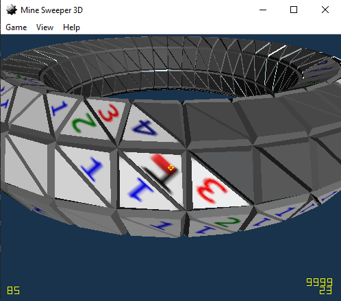
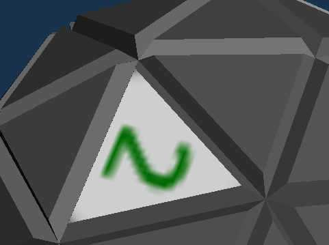
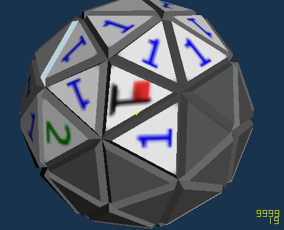
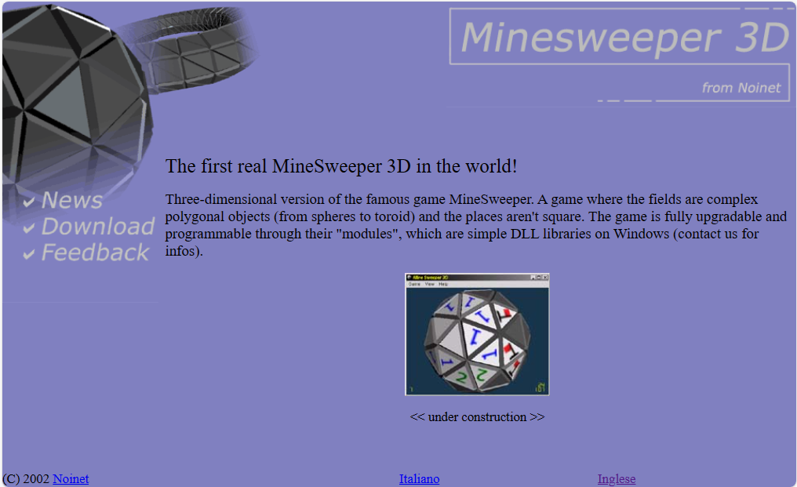
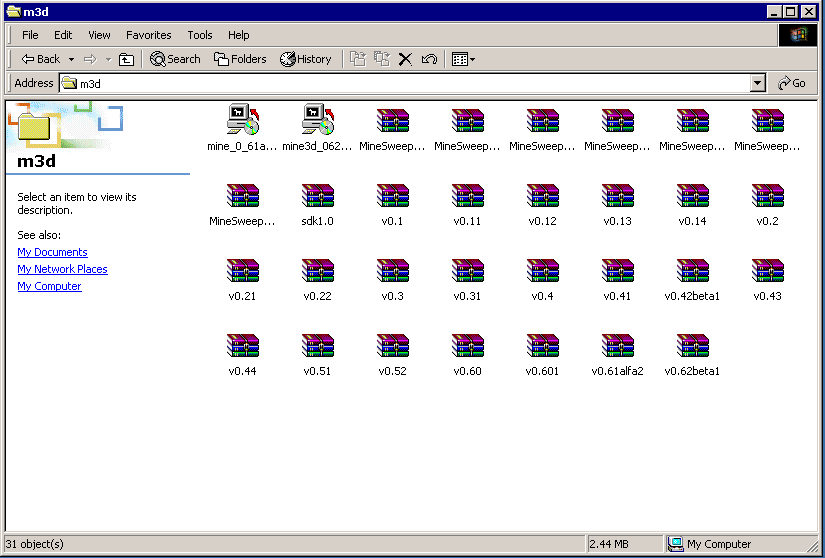

# Minesweeper 3D

A 3D clone of the Microsoft Windows Minesweeper game, built back in 2001/2002 just for fun.

Notable features for that juvenile project:

- OpenGL interop with MFC
- Dynamic library loading of maps with MSVC API
- Null-soft installer (NSIS)
- Binaries and installer still works on Windows 10!


<div style="text-align: center;"><em>For seasoned players only</em></div>
<br/>

## History

During final exams and the master thesis on computer vision, I was playing with the 3D APIs and frameworks.

After have experimented enough years before with DOS-based VGA applications (both 2D and 3D in late 90's), and then explored the DirectDraw API (with a quite elaborated Matrix-like screensaver), it was time to invest time in exercising the 3D transformation matrices.

Probably trying some sample code about OpenGL and mouse interaction to rotate the classic cube model, the idea of implementing the immortal Minesweeper comes up.

## Gameplay

The game target was to use the same fast mouse gestures (move on a 2D surface and click left/right buttons to flag mines and to discover free areas). In order to support free-form 3D maps, each map was containing the logic to pan the camera over the 3D map only using the 2D x/y mouse movement.

Basically, the mouse pointer would then hover/pan over the 3D map without requiring additional keyboard or mouse gestures. This allow the fastest response from a "classic" Minesweeper pro player.

Probably the idea came from the sample applications of OpenGL/DirectX application, in which typically an object could be rotated in the view using the mouse.

There is however an issue about "calibration" of such movement, since they are somehow depending to the app current window size.

## Code structure

The game engine was written to run as a generic rendering engine, and with tessellated maps developed as DLL/plug-ins in order to increase the playability.

To load the DLL maps, a folder scan will run at startup, searching for `.dll` files in the `plugins` folder and automatically loading them.

> This was a common solution for the software of this age, see Winamp.

The DLL loading was implemented around the `GetFunctionAddress` win32 API, searching for the entry-points by name, using "C" linkage naming convention:

```c
    GetMapCount = (GETMAPCOUNT_TYPE) GetFunctionAddress (module, "GetMapCount");
    GetMapName = (GETMAPNAME_TYPE) GetFunctionAddress (module, "GetMapName");
    MouseMove = (MOUSEMOVE_TYPE) GetFunctionAddress (module, "MouseMove");
    SetCameraParams = (SETCAMERAPARAMS_TYPE) GetFunctionAddress (module, "SetCameraParams");
    DestroyMap = (DESTROYMAP_TYPE) GetFunctionAddress (module, "DestroyMap");
    ResetMap = (RESETMAP_TYPE) GetFunctionAddress (module, "ResetMap");
```

and the plugin:

```c
extern "C" {
    void _declspec (dllexport) GetMapCount (int * count);
    void _declspec (dllexport) GetMapName (int mapIdx, char * name);
    int _declspec (dllexport) MouseMove (int mapIdx, GLfloat, GLfloat);
    void _declspec (dllexport) SetCameraParams (int mapIdx, int, int);
    void _declspec (dllexport) DestroyMap (int mapIdx, MINESWEEPER_MAP *);
    void _declspec (dllexport) ResetMap (int mapIdx);
}
```

Probably, doing it now, I would have used a `struct` to keep such function pointers in a class-like object. However the name-based solution is far better in terms of backward compatibility, and it is miming modern managed frameworks like .NET.

## Maps

Each map was described by the algorithm to tessellate a sphere (for the N-th grade icosahedron iterations) or a toroid (for the toroid maps). In both cases, tessellation is done only using triangles: this creates more adjacencies than a classic map with square checkers.

The generating algorithm was done by Vincenzo Carlucci: this was the second collaboration with him for a game concept.

In addition, a classic 2D map was included to benchmark the response times of the program and have a benchmark to compare the speed with the classic game.

## Textures and animations

The map checkers are raised in 3D in order to better resemble the original Windows buttons, but with the correct depth. Also coloring was chosen to recall the same shade of gray used by the old Windows operating systems.


<div style="text-align: center;"><em>Bitmap vs vectors</em></div>
<br/>

This was the first time I played with lighting, with poor results: the material seems too shiny some times.

The down-sized textures applied flatly to each button was actually an exact pixel-by-pixel rip-off of the standard Microsoft game. The plan was to redraw them in high-resolution, or to use proper 3D structures for the flags and the numbers. This would solve the issue of badly oriented textures:


<div style="text-align: center;"><em>Hundreds of orientations</em></div>
<br/>

Animations for the buttons was done using the classic Win32 timers, that notably cannot go over 18.2 fps. Mouse-move events instead was delivered much faster, so the game runs very smoothly (on proper accelerated hardware), but the buttons animation remains glitchy.

## Nullsoft installer and website

Like other shareware of this age, a free Windows Installer was a must. Other professional products like InstallShield was requiring a license, and this was a no-go for our game.

The [Nullsoft Scriptable Install System](https://en.wikipedia.org/wiki/Nullsoft_Scriptable_Install_System) (NSIS) was the prominent choice, and it was super-easy to learn for a simple project like this one, that was only requiring to install some files and the launch link icon.

A quite minimal web-site was also deployed on Tiscali (and it still appears to be there!)


<div style="text-align: center;"><em>Quite embarrassing</em></div>
<br/>

> _Noinet Corp._ is actually a fictional name of our group of friends, and a tag name for any "going-to-fail project".

## Repository reconstruction

At that time, Subversion was not yet a thing, and I didn't know how to use CVS effectively. So the backup was done simply zipping the source files in versioned compressed files.

Such files has survived disk backups, CD-R backups, and then safely landed in the cloud.


<div style="text-align: center;"><em>Vintage</em></div>
<br/>

The `scripts` folder is actually a recent addition to unpack such files in automated way and to build a git repository, with commits and tags for each compressed files.

Luckily, the original NSIS installer files still works on modern Windows, so there was no need to update/rebuild the installers. The [last version](https://github.com/lmartorella/minesweeper3d/releases/latest) is available in the Releases tab of Github.

## How to compile

I haven't tried to recompile the thing, but probably you will only need a Visual C++ 6 compiler, and the NSIS framework to rebuild the installer.

## Legacy

The big issue in this game is that is a real clone of the original Minesweeper, with the only change of the shape of the tiles and the missing board edges. So, it doesn't add anything and it ends up with the same longevity.

A later (not concluded) attempt to port the game to the novel C# language was made in 2002, and the effort culminated with the collaboration of the Gtk# team to develop the [GtkGlExt C# wrapper](https://sourceforge.net/projects/gtkglext/files/gtkglext-sharp/) to run on Linux with the new-born Mono project.

Later, in 2014, I experimented with a completely original gameplay, using DirectX and mixed C#/C++ for Windows 8.1 Mobile. The game, called _Miner3D_, was uploaded on the Microsoft Store, now defunct. I'll probably upload the source code on Github later on.
